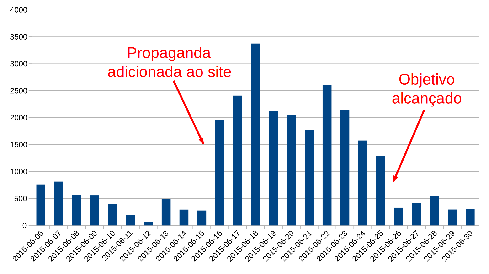

# Semanário 258 ‒ 23.06.‒29.06.2015

23.06.‒29.06.2015

Doações durante a campanha de angariação de fundos para o financiamento de um novo hardware para o OpenStreetMap. [Gráfico: Nakaner; Dados: Frederik Ramm](https://lists.openstreetmap.org/pipermail/osmf-talk/attachments/20150630/feede3ff/attachment-0001.png). [1]

## Sobre nós

* O time WeeklyOSM saúda seus novos amigos [brasileiros](http://www.weeklyosm.eu/pt/) : [Vitor, Alexandre e João](https://wiki.openstreetmap.org/wiki/WeeklyOSM#Languages). Sejam bem vindos, "Welcome", caríssimos amigos do país da [capoeira](https://en.wikipedia.org/wiki/Capoeira), da praia de [Copacabana](https://en.wikipedia.org/wiki/Copacabana_\(Rio_de_Janeiro\)), da [caipirinha](https://en.wikipedia.org/wiki/Caipirinha), de [Jorge Amado](https://en.wikipedia.org/wiki/Jorge_Amado) e [Oscar Niemeyer](https://en.wikipedia.org/wiki/Oscar_Niemeyer)! ;)

* Durante julho e agosto o WeeklyOSM tirará umas pequenas férias de verão. Será fornecido um resumo mensal no início de agosto e outro no início de setembro.

## Mapeamento

* Imagico.de [fornece images](http://blog.imagico.de/images-for-remote-mapping-in-openstreetmap/) para mapeamento remoto OSM, abrangendo áreas onde MapBox e Bing não cobrem ou são muito pobres. Uma visão geral é dada pelo navegador e o serviço de imagens pode habilitado no JOSM.

* Fernando Trebien abre uma [controversa discussão](https://lists.openstreetmap.org/pipermail/talk/2015-June/073414.html) sobre o quão difícil pode ser o mapeador novato entender e usar relações se lança mão dos atuais editores.

* Ture Pålsson [tropeça](https://lists.openstreetmap.org/pipermail/talk/2015-June/073411.html) sobre uma comum má interpreatação da etiqueta `layer`.

## Comunidade

* Mapzen compara o dilúvio de dados no OSM com o "Vórtice da Perspectiva Total", da série de ficção científica  "O Guia do Mochileiro das Galáxias". Já que o seu cérebro não explode, ele opta por focar em categorias de dados individuais. Primeiramente colocam-se [as bordas](https://mapzen.com/blog/total-perspective-vortex) sob o microscópio.

* "Mapeador Viciado" já foi uma das classificações dadas pelo analisador de conjuntos de alterações [hdyc](http://neis-one.org/2012/01/what-type-of-mapper-are-you/) de Pascal Neis, por um tempo. Tim Waters tem outra [abordagem](http://de.slideshare.net/chippy/you-know-when-you-are-addicted-to-osm-when) em sua apresentação. ;)

* Pete Warde está à procura de uma nova casa para o [OpenHeatMap](https://twitter.com/petewarden/status/613811714329448452).

* Por ocasião da [15ª semana de tarefas](http://www.openstreetmap.org/user/edward17/diary/35285) na Ucrânia ([tradução automática](https://translate.google.com/translate?hl=pt-BR&sl=ru&tl=pt&u=http%3A%2F%2Fwww.openstreetmap.org%2Fuser%2Fedward17%2Fdiary%2F35285)), Edward17 publicou estatísticas e imagens que comparam o antes e o depois.

* Graças à [comunidade Python](https://github.com/PythonParaguay/osm-paraguay-data/), no Geofabrik agora também temos dados OSM referentes ao [Paraguai](http://download.geofabrik.de/south-america/paraguay.html). 

* Manuel Kaufmann (_aka_ [humitos](http://www.openstreetmap.org/user/Humitos)) blogou sobre como se pode [mapear desconectado usando JOSM](http://elblogdehumitos.com.ar/posts/edicion-openstreetmap-offline/). ([tradução automática](https://translate.google.de/translate?hl=pt-BR&sl=es&tl=pt&u=http%3A%2F%2Felblogdehumitos.com.ar%2Fposts%2Fedicion-openstreetmap-offline%2F)) 

* Você gostaria de se mudar para a ensolarada Califórnia? Telenav está oferecendo [dois postos de trabalho](https://lists.openstreetmap.org/pipermail/talk-us/2015-June/015040.html) que podem interessar a um mapeador OSM.

* Uma [comunidade local](https://lists.openstreetmap.org/pipermail/talk-us/2015-June/015036.html) foi criada para mapear a [Marilândia do Sul](https://wiki.openstreetmap.org/wiki/Mapping_Southern_Maryland).

## Fundação OpenStreetMap

* A meta de angariação de fundos para a aquisição do novo hardware de servidor foi alcançada e superada. O grupo de trabalho de operações (OWG) [diz seu muito obrigado](http://donate.openstreetmap.org/server2015/)! Frederik Ramm [compilou](https://lists.openstreetmap.org/pipermail/osmf-talk/2015-June/003348.html) alguns dados interessantes.

## Eventos

* [Fatos e imagens](http://openstreetmap.us/2015/06/sotmus-by-the-numbers/) do SotM US 2015.

* De 30 de setembro a 4 de outubro, acontecerá o SotM da Escócia, em [Edinburgh](http://www.openstreetmap.org/user/Hawkeye/diary/35299). A programação já está parcialmente [online](https://wiki.openstreetmap.org/wiki/State_of_the_Map_Scotland_2015#Programme).

* O usuário Gowin relatou um [workshop OSM](http://www.openstreetmap.org/user/GOwin/diary/35296) realizado em Manila, no Instituto de Tecnologia FEU.

* Numa cooperação entre [geoimagina](http://www.geoimagina.com/quienes-somos) e o [Instituto Panamericano de Geografia e História](http://www.ipgh.gob.ec/portal/index.php/institucion/mision-vision-valores), a seguinte série de eventos terá lugar em Quito: 9 de julho – Introdução ao OSM; 21 de julho – Criando geoportais com software livre; 28 de julho – Produzindo geoestatísticas com R; 20 de agosto – Cenários de risco para a ameaça de tsunamis. 

* Frederik Ramm [está procurando](https://lists.openstreetmap.org/pipermail/talk-at/2015-June/007765.html) voluntários austríacos que possam ajudá-lo a  planejar e realizar o FOSSGIS 2016.

## OSM Humanitário

* O Time Humanitário do OpenStreetMap (HOT) está recrutando um consultor de pesquisa temporário, para um curto-prazo de apenas [dois meses](http://hotosm.org/job/research_consultant_openaerialmap/2015). Inscrições podem ser realizadas até o dia 3 de julho. 

* O usuário dkunce completou suas primeiras três "horas de trabalho" fazendo [sessão de perguntas e respostas](http://www.openstreetmap.org/user/dkunce/diary/35272) para o HOT. Em seu diário, resume as três principais questões que lhe foram apresentadas.

## Mapas

* Um mapeador polonês mostra em um mapa as [estatísticas de densidade populacional](http://www.merkato.polineo.pl/qa/#9/52.8418/19.2769) para a maioria das cidades.

## Dados Abertos

* O Ministério Britânico do Meio Ambiente anunciou a liberação de 8 mil conjuntos de dados sob uma licença livre. ([via @DefraGovUK](https://twitter.com/DefraGovUK/status/613988823803035648))

## Licenças

* Um possível efeito colateral bom de [omitir a atribuição](https://lists.openstreetmap.org/pipermail/legal-talk/2015-June/008139.html) seria a prevenção de vandalismo?

* Jan Erik Solem [tem questões](https://lists.openstreetmap.org/pipermail/legal-talk/2015-June/008140.html) sobre a ODbL, já que o Mapillary tende cada vez mais a usar dados OSM.

## Software

* Usando o plugin [OSMroute](https://plugins.qgis.org/plugins/OSMroute/) é possível calcular rotas do openroutservice.org em QGIS.

* O Wall Street Journal publicou uma [biblioteca JavaScript](http://dowjones.github.io/pinpoint/) para a criação fácil de mapas em poucos cliques.

* OsmAnd completa [cinco anos](http://osmand.net/blog?id=5_years). A equipe WeeklyOSM parabeniza essa _app_ que é considerada por muitos não-mapeadores como sendo o OpenStreetMap para Android.

* Demonstrou-se [recentemente](https://vimeo.com/131866488) como o [OpenSfM](https://github.com/mapillary/OpenSfM) pode fazer transições suaves de fotos do Mapillary. (exemplos anteriores estão no [blog do Mapillary](http://blog.mapillary.com/update/2014/12/15/sfm-preview.html)).

* O mapa do MapBox, baseado em OpenGL, agora [suporta](https://www.mapbox.com/blog/mapbox-gl-js-0-8-1/) uma vista em perspectiva.

* Richard Fairhurst [criou](http://blog.systemed.net/post/13) o [Tilemaker](https://github.com/systemed/tilemaker), uma ferramenta para gerar _tiles_ em vetor a partir de extrações PBF.

* Michael Zangl [liberou](https://lists.openstreetmap.org/pipermail/josm-dev/2015-June/007438.html) uma versão beta de seu _OpenGL MapViews for JOSM_, que foi programado no contexto de seu projeto para o Google Summer of Code.

## Você sabia ...

* ... do [POI – map](http://pois.elblogdehumitos.com.ar/#14/-0.2040/-78.4505) em espanhol? 

## Outras coisas "geo"

* Há [rumores](https://twitter.com/shtosm/status/613642856457240577) de que Dennis Luxen agora trabalha com a Apple.

* Geocache estava [debaixo da ponte](http://www.sz-online.de/nachrichten/lebensgefaehrlicher-geocaching-punkt-von-bruecke-ueber-bahretal-entfernt-3132806.html) ([tradução automática](https://translate.google.com/translate?sl=de&tl=pt&js=y&prev=_t&hl=pt-BR&ie=UTF-8&u=http%3A%2F%2Fwww.sz-online.de%2Fnachrichten%2Flebensgefaehrlicher-geocaching-punkt-von-bruecke-ueber-bahretal-entfernt-3132806.html&edit-text=&act=url)). Um rapel muito doido! [Veja as fotos](http://www.sz-online.de/sachsen/irrsinn-am-autobahnzubringer-g15410.html?StoryId=3132806).

* CartoDB vende o seu peixe e explica [o que muda](http://blog.cartodb.com/gme-workflows-on-cartodb/?utm_content=17249811) para quem vem do Google Maps Engine.

* Tim Sutton chama nossa atenção para um [polêmico](https://twitter.com/timlinux/status/611048497584979968) artigo de Lewis Graham sobre a GPL no LIDAR. O grupo de usuários [QGIS-CH](https://twitter.com/QGISCH) comentou o _post_ de Graham citando [Mahatma Gandhi](http://izquotes.com/quote/68010).

* No CityLab, Laura Bliss teceu comentários sobre o [crescimento do OSM](http://www.citylab.com/design/2015/06/who-owns-the-digital-map-of-the-world/396119/) e o avaliou positivamente. Segundo ela, com o OpenStreetMap um competidor cresce para ser nosso "companheiro de mercado".

* "[Quem precisa de GPS](http://www.fastcompany.com/3047828/who-needs-gps-the-forgotten-story-of-etaks-amazing-1985-car-navigation-system)?"

* Microsoft [vende](http://www.heise.de/newsticker/meldung/Microsoft-verkauft-Online-Werbung-und-Karten-Technik-2731408.html) sua divisão de mapas à Uber. Os dados para o Bing Maps virão de um parceiro. Nós recomendamos dados OpenStreetMap! O uso das imagens de satélite pelo OSM não será imediatamente afetado, [disse Ricky Brundritt](https://twitter.com/rbrundritt/status/616028862531530752) (Gerente de Programa para o Bing Maps).

* Chris Hormann reflete sobre a [acurácia das imagens de satélite](http://blog.imagico.de/uber-die-genauigkeit-von-satellitenbildern/) ([tradução automática](https://translate.google.com/translate?hl=pt-BR&sl=de&tl=pt&u=http%3A%2F%2Fblog.imagico.de%2Fuber-die-genauigkeit-von-satellitenbildern%2F)).

